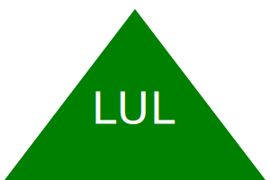

# Zekes SVG Logo Generator

## BADGES/License🔖

---

[](https://opensource.org/license/mit/)

## Description 📖

---

> A simple SVG logo generator using JS, Objected oriented programming and inquirer can be built by creating separate shape classes for each shape (circle, square, triangle), and using inquirer to prompt the user for the desired shape, text, color of the shape on the canvas. To ensure code quality and functionality, Jest can be used for unit testing, to test the shape classes and ensure they behave as expected.

### Example of Logo

---



## Video Demo 💻

---

> [Demonstration](https://drive.google.com/file/d/1gfQ9KPuOsxm8e4mqujJMbBKrUwtIyz6Y/view)

## Acceptance Criteria ✔️

---

```md
GIVEN a command-line application that accepts user input
WHEN I am prompted for text
THEN I can enter up to three characters
WHEN I am prompted for the text color
THEN I can enter a color keyword (OR a hexadecimal number)
WHEN I am prompted for a shape
THEN I am presented with a list of shapes to choose from: circle, triangle, and square
WHEN I am prompted for the shape's color
THEN I can enter a color keyword (OR a hexadecimal number)
WHEN I have entered input for all the prompts
THEN an SVG file is created named `logo.svg`
AND the output text "Generated logo.svg" is printed in the command line
WHEN I open the `logo.svg` file in a browser
THEN I am shown a 300x200 pixel image that matches the criteria I entered
```

## Contact me 📇

---

- [Via Email](mailto:franciaexequiel@hotmail.ca)
- [Via Github](https://github.com/Tweakiel)
